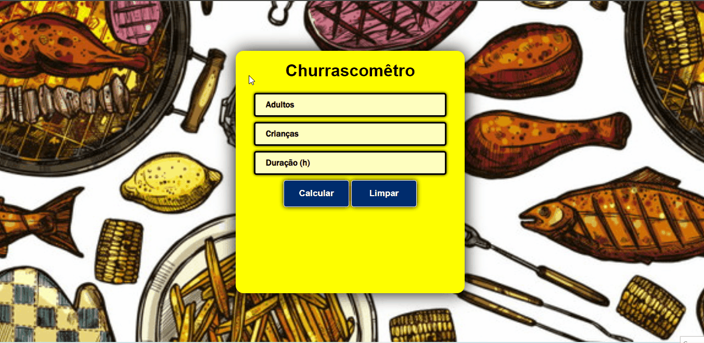
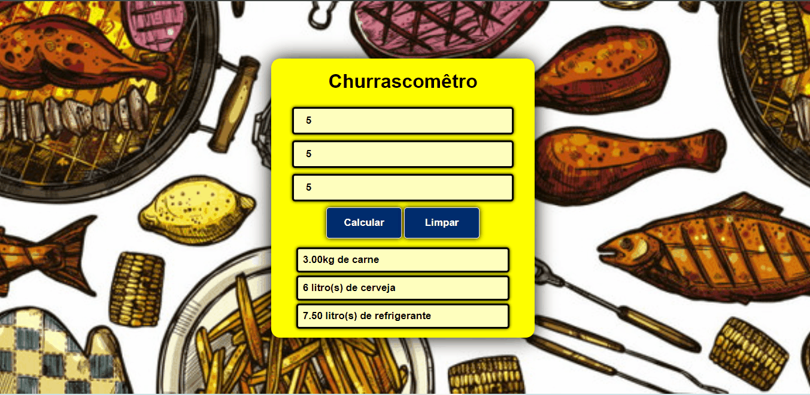

    

# Churrascomêtro

>Uma simples aplicação que calcula a quantidade de carne, cerveja e refrigerante com base na quantidade de pessoas e horas. 
---
   

# Funcionalidades

### Calcular

  

### Botão que limpa as menssagens e os inputs

  

### Mensagem de erro
>Não pode ser deixado nem um input sem valor.

  

----
   

## 👨‍💻Tecnologias usadas

✔ JavaScript

✔ HTML

✔ CSS

---
   

## Meta
**Made by:** Lucas Lopes

[Linked-in](https://www.linkedin.com/in/lucas-lopes-840965190/ "My Linked-in")

[E-mail](mailto:lucas.santos.pessoal@outlook.com "My e-mail")

 
